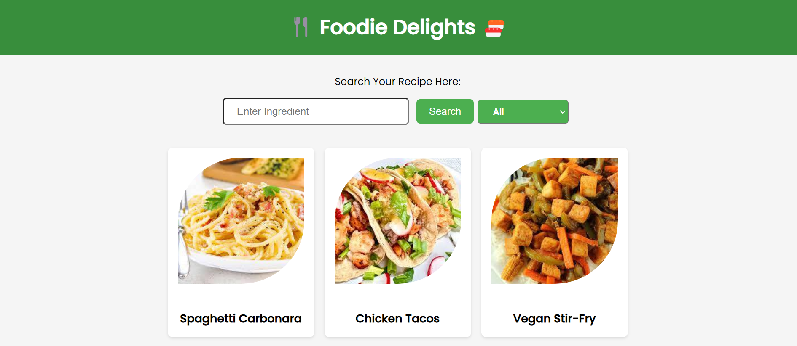
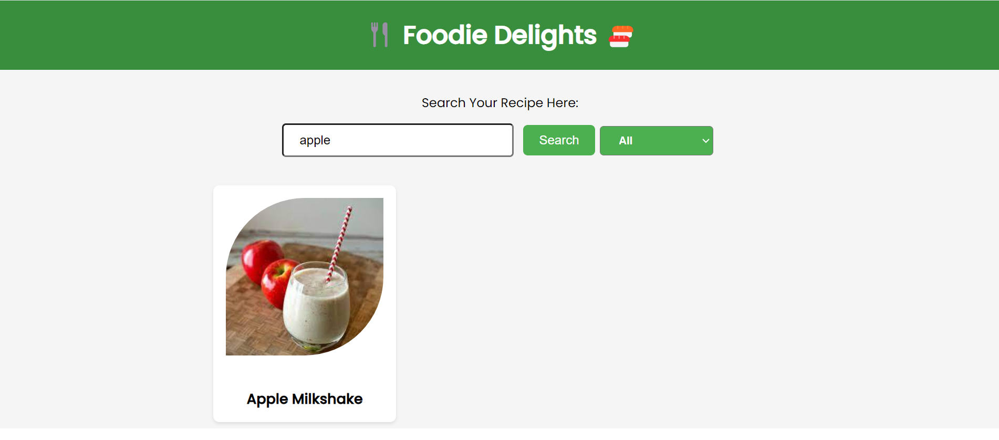
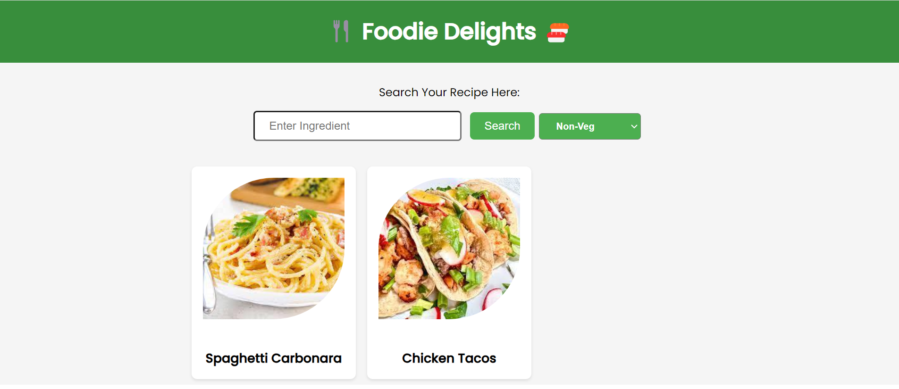

# Foodie Delights - Recipe Application

## Estimated Time: 60 minutes

Develop a Foodie Delights Recipe App for users to easily find, save, and explore diverse recipes based on ingredients and dietary preferences. Simplify cooking and meal planning with this convenient and delicious recipe app.

## Objectives:

By the end of this lab, you will have achieved the following:

**1.** Created a React-based project called Foodie Delights Recipe Application.

**2.** Developed a user-friendly and intuitive recipe browsing and management system.

**3.** Efficiently managed recipe data, including ingredients, dietary information, and instructions, utilizing React's state management (e.g., `useState`).

**4.** Implemented interactive features for users to browse, search, and save recipes for creating an engaging experience.

**5.** Enhanced the application's visual appeal and user experience through well-designed CSS styles.

**6.** Ensured cross-browser compatibility and conducted thorough testing to deliver a reliable web application.

**7.** Employed Git for version control, facilitating collaboration and maintaining a structured codebase for the Foodie Delights Recipe Application.

## Exercise 1: Setup a React Project

**Fork the sample Git repository**

**1.** Go to the project repository [here](https://github.com/sktcontentteam/react-app-bmi-calculator.git) 
which has the partially developed code for this react project.

**2.** Create a fork of the repository into your own GitHub Account. 

*You will need to have a github account of your own to do so.*
*If you dont already have one, please refer to the [link](https://github.com/) to create a new GitHub Account by following the instructions.*

 

**3.** Go to your forked repository and copy the url to clone your repo in the local workspace.

 

**4.** In the Visual studio code, Open a terminal window by using the menu in the editor: Terminal > New Terminal.

 

 

**5.** Modify the directory location where you intend to store your project in your local workspace, as demonstrated below.

 

**6.** Clone the forked repository by running the command given below: 

```
git clone <your_repo_name>
```

 

**7.** This will clone the repository with BMI Calculator application files in your home directory in the Visual Studio Code. You can check the source folder created by using the below command.

```bash
ls
```

**8.** Change to the project directory and check the project structure and files within it, using the below command.

```bash
cd react-recipe-app && ls
```

**9.** All packages required to be installed are listed in the file `package.json`. Execute the command given below, to save and install the packages.

```bash
npm install -s
```

**10.** The folder structure of the react-recipe-app should be similar to the structure shown in the screenshot below. 


## Exercise 2: Place the UI Components

The UI of the Foodie Delights - Recipe Application that you will create in this lab will be similar to the image shown below.




## Features:

In this project, you will harness the capabilities of React.js to craft the Foodie Delights Recipe Application, a dynamic platform for discovering and exploring diverse recipes.

React.js empowers you to manage state, handle events, and render dynamic UI elements, making it the ideal framework for building this interactive and engaging culinary application.

**i.** Create a robust search functionality allowing users to find recipes based on ingredient input and filter recipes by category.

**ii.** Implement a detailed recipe view that showcases step-by-step instructions, ingredients, and additional information.

**iii.** Design a responsive user interface that adapts seamlessly to various screen sizes and devices.

**iv.** Enhance user experience through input validation, ensuring accurate and reliable search results.


## Create the Foodie Delights - Recipe App Component

## Step 1: Declare Required `useState` Variables

In the `app.js` file, we begin by declaring the necessary `useState` variables to manage the state of our Foodie Delights Recipe Application. These variables are used to store important data and manage the application's functionality.

**i.** `recipes` and `setRecipes`: These variables manage the state of recipes data and allow us to update it as needed.

**ii.** `loading` and `setLoading`: These variables help us manage the loading state of the application, ensuring a smooth user experience.

**iii.** `query` and `setQuery`: These variables store and update the user's input for recipe search.

**iv.** `selectedCategory` and `setSelectedCategory`: These variables track the user's selected category filter for recipe search.

**Solution:** Replace the following placeholder code in `app.js`:

```javascript
// Initialize required state for recipes and loading
  const [recipes, setRecipes] = useState([]);
  const [loading, setLoading] = useState(true);
  const [query, setQuery] = useState("");
  const [selectedCategory, setSelectedCategory] = useState("All");
```

## Step 2: Create UI Components

In the `app.js` file, we define the user interface (UI) components required for the Foodie Delights Recipe Application. These components include the search input field, category filter dropdown, and elements to display recipe results.

**Solution:** Replace the following placeholder code in `app.js` with your UI components:

```javascript
// Step 2: Create UI Components 
<Router>
<div className="app">
  {/* Header */}
  <div className="app_header">
    <Link to="/" className="linktext">
      <h1>🍴 Foodie Delights 🍣</h1>
    </Link>
  </div>
  
  {/* Search Form */}
  <p>Search Your Recipe Here:</p>
  <form className="app__searchForm" onSubmit={onSubmit}>
    <input
      className="app__input"
      type="text"
      placeholder="Enter Ingredient"
      autoComplete="off"
      value={query}
      onChange={(e) => setQuery(e.target.value)}
    />
    <input className="app__submit" type="submit" value="Search" />
    <select
      className="app__category"
      value={selectedCategory}
      onChange={(e) => setSelectedCategory(e.target.value)}
    >
      {categoryOptions.map((category) => (
        <option key={category} value={category}>
          {category}
        </option>
      ))}
    </select>
  </form>

  {/* Recipe Results */}
  {loading ? (
    <p>Loading...</p>
  ) : (
    <div className="app__recipes">
      {recipes.length !== 0 ? (
        <Routes>
          <Route
            path="/"
            element={
              <div className="recipe-grid">
                {recipes.map((recipe) => (
                  <Link
                    className="linktext"
                    key={recipe.label}
                    to={`/recipe/${encodeURIComponent(recipe.label)}`}
                  >
                    <RecipeTile recipe={recipe} />
                  </Link>
                ))}
              </div>
            }
          />

          <Route
            path="/recipe/:label"
            element={<RecipeDetailsWrapper recipes={recipes} />}
          />
        </Routes>
      ) : (
        <p>No recipes found.</p>
      )}
    </div>
  )}
</div>
</Router>
```

## Step 3: Implement Required Functions for Filtering Recipes

In this step, we will create the necessary functions used in the UI components to filter and manage the recipe data based on user input. These functions are essential for enabling users to search for recipes and filter them by category.

### 1. Load Recipes Data

We will begin by simulating the loading of recipe data using a `setTimeout`. This will initialize the application with sample recipe data and set the loading state to `false` once the data is loaded.

```javascript
useEffect(() => {
  setTimeout(() => {
    setRecipes(recipesData);
    setLoading(false);
  }, 1500);
}, []);
```

### 2. Generate Options for Filtering Recipes by Category

Next, we'll generate options for filtering recipes by category. We collect unique categories from the recipe data and include an "All" option for displaying all recipes.

```javascript
const healthLabelsOptions = Array.from(
  new Set(recipesData.flatMap((recipe) => recipe.category))
);

const categoryOptions = ["All", ...healthLabelsOptions];
```

### 3. Function to Filter Recipes Based on Query and Category

We'll create a function to filter recipes based on the user's input query and selected category. This function creates a copy of the original data, applies filters, and updates the displayed recipes.

```javascript
const filterRecipes = () => {
  let filteredRecipes = [...recipesData];

  if (selectedCategory !== "All") {
    filteredRecipes = filteredRecipes.filter((recipe) =>
      recipe.category.includes(selectedCategory)
    );
  }

  if (query.trim() !== "") {
    filteredRecipes = filteredRecipes.filter((recipe) =>
      recipe.label.toLowerCase().includes(query.toLowerCase())
    );
  }

  setRecipes(filteredRecipes);
};
```
### 4. Handle Form Submission to Trigger Filtering

Finally, we handle form submission to trigger the filtering process. This function prevents the default form submission behavior and calls the filterRecipes function to update the displayed recipes based on the user's input.

```javascript
const onSubmit = (e) => {
  e.preventDefault();
  filterRecipes();
};

```

## Step 4: Complete RecipeTile.js

In this step, we will complete the `RecipeTile.js` component to render a recipe tile. This tile will display an image of the recipe along with its label.

### RecipeTile.js

Open the `RecipeTile.js` file located at `src/components/RecipeTile.js` and add the following code:

```javascript
import React from "react";
import "../assets/css/RecipeTile.css";

export default function RecipeTile({ recipe }) {
  // Regular expression to validate image URLs
  const imageRegex = /\.(jpeg|jpg|gif|png)$/;
  const isImageValid = recipe?.image?.match(imageRegex) !== null;

  return isImageValid ? (
    // Create the structure for the recipe tile
    <div className="recipeTile">
      
      <p className="recipeTile__name">{recipe?.label}</p>
    </div>
  ) : null;
}
```

## Step 5: Complete RecipeDetails.js

In this step, we will complete the `RecipeDetails.js` component to render the detailed information of a recipe. This component will display the recipe's image, label, cuisine type, meal type, ingredients, and category.

### RecipeDetails.js

Open the `RecipeDetails.js` file located at `src/components/RecipeDetails.js` and add the following code:

```javascript
import React from "react";
import '../assets/css/RecipeDetails.css';

export default function RecipeDetails({ recipe }) {
  return (
    // Define the structure to display the recipe details
    <div className="recipe-details">
      <div className="recipe-details-content">
        <div className="recipe-details-left">
          
        </div>
        <div className="recipe-details-right">
          <h2>{recipe.label}</h2>
          <p>Cuisine Type: {recipe.cuisineType.join(", ")}</p>
          <p>Meal Type: {recipe.mealType.join(", ")}</p>
          <p>Ingredients: {recipe.ingredients.join(", ")}</p>
          <p>Category: {recipe.category.join(", ")}</p>
        </div>
      </div>
      <div className="recipe-details-method">
        
      </div>
    </div>
  );
}
```

## Step 6: Import Components and Data into App.js

In this step, we will import the necessary components and recipe data into the `App.js` file, which is the main component of your Foodie Delights Recipe Application.

### App.js

Open the `App.js` file located at the root of your project and add the following import statements at the top of the file:

```javascript
import React, { useState, useEffect } from "react";
import { BrowserRouter as Router, Route, Link, Routes } from "react-router-dom";
import "./assets/css/App.css";
import RecipeTile from "./components/RecipeTile"; // Import RecipeTile component
import RecipeDetails from "./components/RecipeDetails"; // Import RecipeDetails component
import recipesData from "./data/recipes.json"; // Import recipeData from JSON file
```

## Launch, View, and Test Your Foodie Delights Recipe App

Follow these steps to launch, view, and test your Foodie Delights Recipe App in a web browser:

1. **Navigate to Your Project Directory**: Open your terminal or command prompt and make sure you are in the directory where your Foodie Delights Recipe App project is located.
  ```bash
  cd react-recipe-app
  ```


2. **Start the Development Server**: Start the development server by executing the following command in your terminal:

   ```bash
   npm start
   ```

## Test the App

To ensure that your Foodie Delights Recipe App functions as expected, follow these steps to test its various features:

1. **Search Functionality**:
   - Enter 'Apple' in the input box.
   - Click the "Search" button to test the search functionality.



2. **Category Filtering**:
   - Use the category filter to test filtering by different categories.
   - Select different categories to filter the recipes accordingly and observe the results.



## Recipe Details

After performing a search and filtering by categories, you can access detailed information about a specific recipe by following these steps:

1. **View Recipe Details**:
   - After performing a search or applying category filters, click on any recipe tile to view its detailed information.
   - Explore the recipe's details, including its image, label, cuisine type, meal type, ingredients, and category.

By following these steps, you can thoroughly test the search functionality, category filtering, and recipe details in your Foodie Delights Recipe App to ensure that it works seamlessly and provides a delightful user experience.


## Commit and push your local code to your remote git repository


1. **Check Git Status:**
   Before committing any changes, check the status of your local repository to see what files have been modified and need to be committed. Open your terminal or command prompt and navigate to your project directory after which you can execute the below command.

   ```bash
   git status
   ```

2. **Add Changes to the Staging Area:**
   Use the `git add` command to add the files you want to commit to the staging area. The `.` adds all the files that have been modified in the current working directory.

   ```bash
   git add .
   ```

3. **Set Your Git User Email and Name:**
   If you haven't already configured your email and name globally, use the `git config` command to set them.

   ```bash
   git config --global user.email "your_email@example.com"
   git config --global user.name "Your Name"
   ```

   Replace `"your_email@example.com"` with your email and `"Your Name"` with your name.

4. **Commit Changes:**
   Commit the changes in the staging area with a meaningful commit message using the `git commit` command. Replace `'Completed the code'` with a concise description of your changes.

   ```bash
   git commit -m 'Completed the code'
   ```

5. **Push to Remote Repository:**
   Push your committed changes to the remote Git repository using the `git push` command. Replace `origin` with the name of your remote repository (often "origin") and `branch_name` with the name of the branch you want to push (e.g., "main" or "master").

   ```bash
   git push origin branch_name
   ```

   If you are pushing to the default branch (e.g., "main"), you can simply use:

   ```bash
   git push origin
   ```

Congratulations! You have successfully completed the BMI Calculator application lab. With this application, users can calculate BMI in two units cm/kg and ft/lb.

## Author(s)

Nikesh Kumar

**Change Log**

| Date | Version | Changed by | Change Description |
|------|--------|--------|---------|
| 2023-09-15 | 1.0 | Nikesh Kumar | Initial version created |
| 2023-09-15 | 1.1 | Sapthashree K S | Review and Minor Updates |

## <h3 align="center"> © Skills Network 2023. All rights reserved. <h3/>
